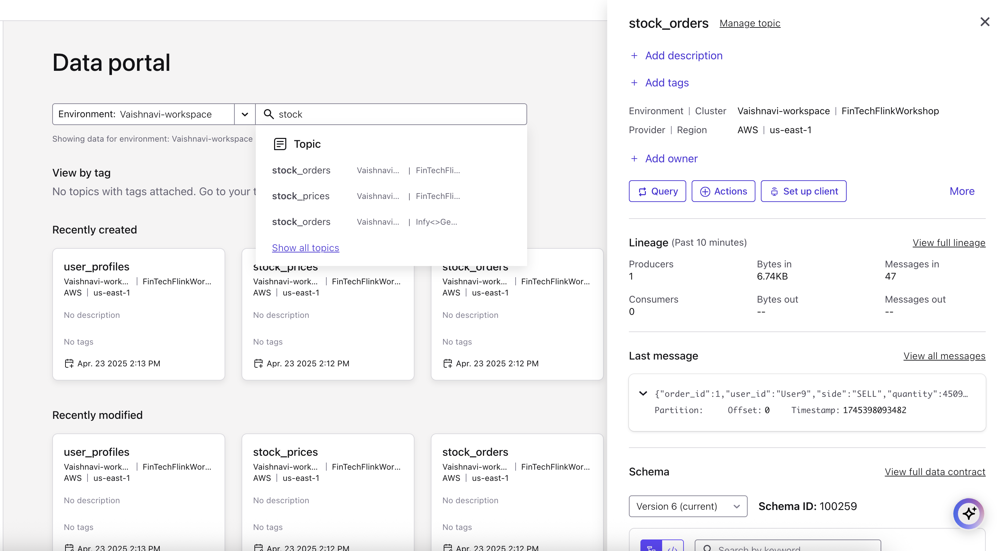
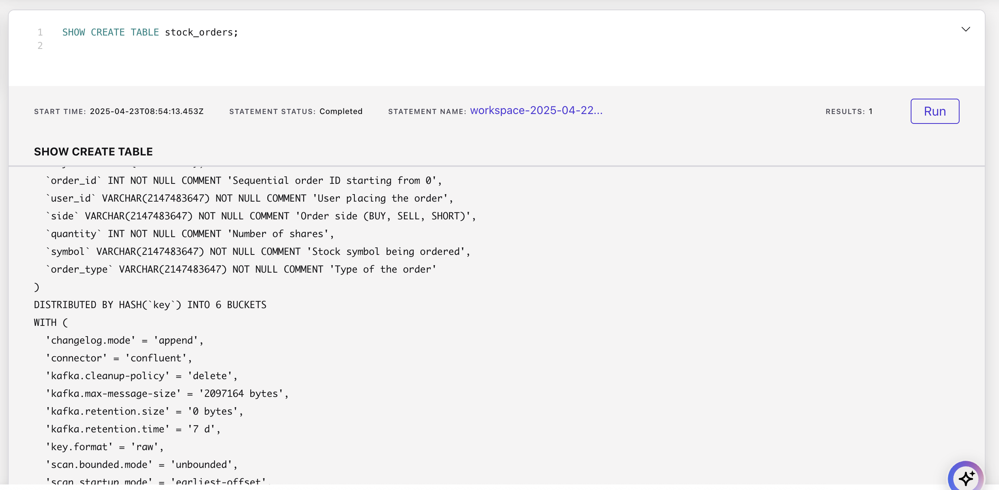

# Lab 1

All required resources in Confluent Cloud must be already created for this lab to work correctly. If you haven't already, please follow the [prerequisites](prereq.md).

## Content of Lab 1

[1. Verify Confluent Cloud Resources](lab1.md#1-verify-confluent-cloud-resources)

[2. Create Pool](lab1.md#2-create-pool)

[3. Connecting to Flink](lab1.md#3-connecting-to-flink)

[4. Flink Tables](lab1.md#4-flink-tables)

[5. Select Queries](lab1.md#5-select-queries)

[6. Aggregations](lab1.md#6-aggregations)

[7. Time Windows](lab1.md#7-time-windows)

[8. Tables with Primary Key](lab1.md#8-tables-with-primary-key)

[9. Flink Jobs](lab1.md#9-flink-jobs)

## 1. Verify Confluent Cloud Resources
Let's verify if all resources were created correctly and we can start using them.

### Kafka Topics
Check if the following topics exist in your Kafka cluster:
 * stock_orders (for stock order trade data),
 * stock_prices (for dynamic stock price data),
 * user_profiles (for users data aka user CRM).

### Schemas in Schema Registry
Check if the following Avro schemas exist in your Schema Registry:
 * stock_orders-value,
 * stock_prices-value,
 * user_profiles-value.

NOTE: Schema Registry is at the Environment level and can be used for multiple Kafka clusters.

### Datagen Connectors
Your Kafka cluster should have three Datagen Source Connectors running. Check if their topic and template configurations match the table below.

| Connector Name (can be anything)     |      Topic      | Format  |             Template      | 
|--------------------------------------|:---------------:|--------:|--------------------------:|
| **DatagenSourceConnector_stocks**    | stock_orders    |   AVRO  |  **Trades**               | 
| **DatagenSourceConnector_prices**    | stock_prices    |   AVRO  | **Realtime Stock Prices** | 
| **DatagenSourceConnector_users**     | user_profiles   |   AVRO  |  **Trade Customers**      | 

## 2. Create Pool

### Create Flink Compute Pool
Create a Flink Compute Pool in environment `handson-flink`. Now go back to environment `handson-flink` and choose the `Flink` Tab. From there we create a new compute pool:
* choose a cloud region, click `continue` and 
* enter Pool Name: `cc_flink_compute_pool` with 10 Confluent Flink Units (CFU) and 
* click `Continue` button and then `Finish`.
* 
The pool will be provisioned and ready to use in a couple of moments.
AWS Pools take 1-2 minutes. Azure Pools can take 5-7 minutes.


## 3. Connecting to Flink 
You can use your web browser or console to enter Flink SQL statements.
  * **Web UI** - from the Home page click on the `Stream Processing` on the left side navigation
    Select you environment `handson-flink` and click button 'Create workspace'
    - select your cloud provider and region you want to use
    - click 'Create workspace'

    


  * **Console** - copy/paste the command from your Flink Compute Pool to the command line.    
  Of course you could also use the the Flink SQL Shell. For this, you need to have Confluent Cloud Console tool installed and be logged in with correct access rights.
  Copy the command out of the Compute Pool Window and execute it in your terminal (we prefer iterm2). 

  ```bash
  confluent flink shell --compute-pool <pool id> --environment <env-id>
  ```

NOTE: You can also access your Flink Compute Pool from the Data Portal as shown below. Just click on `Data Portal` in the main menu on the left side. Then select your Environment. You should see your topics. When you click on any of the topic tiles you can query the topic's data using Flink. 

Data Portal: `stock_orders` topic selected. Click on `Query` button to access your Flink Compute Pool.



## 4. Flink Tables
Let's start with exploring our Flink tables.
Kafka topics and schemas are always in sync with our Flink cluster. Any topic created in Kafka is visible directly as a table in Flink, and any table created in Flink is visible as a topic in Kafka. Effectively, Flink provides a SQL interface on top of Confluent Cloud.

Following mappings exist:
| Kafka          | Flink     | 
| ------------   |:---------:|
| Environment    | Catalog   | 
| Cluster        | Database  |
| Topic + Schema | Table     |

We will now work with the following SQL Worksheet:


Make sure you work with the correct Flink catalog (=environment) and database (=Kafka cluster).
 

If you are using console client you need to select your catalog and database:
```
USE CATALOG <MY CONFLUENT ENVIRONMENT NAME>;
```
```
USE <MY CONFLUENT KAFKA CLUSTER NAME>;
```

Check if you can see your catalog (=Environment) and databases (=Kafka Clusters):
```
SHOW CATALOGS;
```
```
SHOW DATABASES;
```

List all Flink Tables (=Kafka topics) in your Confluent Cloud cluster:
```
SHOW TABLES;
```
Do you see tables `stock_orders`, `stock_prices`, `user_profiles`?


You can add multiple query boxes by clicking the `+` button on the left.


Understand how the table `stock_orders` was created:
```
SHOW CREATE TABLE stock_orders;
```



You can find more information about all parameters  [here.](https://docs.confluent.io/cloud/current/flink/reference/statements/create-table.html)

### 5. Select Queries
Our Flink tables are populated by the Datagen connectors.

Let us first check the table schema for our `stock_prices` catalog. This should be the same as the topic schema in Schema Registry.
```
DESCRIBE stock_prices;
```

Let's check if any stock records exist in the table.
```
SELECT * FROM stock_prices;
```

Now check if the `user_profiles` schema  exists. 
```
DESCRIBE user_profiles;
```

Are there any users in user_profiles whose last name starts with `B` ?
```
SELECT * FROM user_profiles
  WHERE `name` LIKE 'B%';
```

Check all attributes of the `stock_orders` table including hidden attributes. This will show regular DESCRIBE and system columns.
```
DESCRIBE EXTENDED stock_orders;
```
Noticed the `$rowtime`, a system column in Apache Flink SQL that captures the event-time timestamp of a Kafka record. In our use case, this will represent the exact time an order was created or placed, which will be leveraged in downstream transformations and time-based analytics.

Now let's check the first ten stock trades for one user.
```
SELECT *
  FROM stock_orders
  WHERE user_id = 'User9'
  LIMIT 10;
```

### 6. Aggregations
Let's try to run more advanced queries.

First find out the number of user_profile records and then the number of unique users.

```sql
SELECT COUNT(user_id) AS num_users FROM user_profiles;
```

```sql
SELECT COUNT(DISTINCT user_id) AS num_users FROM user_profiles;
```
Noticed a difference in the results between the two queries above:
This is because user_profiles is a continuous event stream capturing updates for users over time—resulting in multiple records per user. However, our goal is to track only the unique set of customers.
We’ll address this by creating a materialized view in Section 8 to maintain the latest profile per unique user.

For now let's try some basic aggregations with the stock catalog records.
For each stock let's detect volatility or price range, find the min and max price for that stock. 
```sql
SELECT
  symbol,
  MIN(price) AS min_price,
  MAX(price) AS max_price
FROM stock_prices
GROUP BY symbol;
```

NOTE: You can find more information about Flink aggregations functions [here.](https://docs.confluent.io/cloud/current/flink/reference/functions/aggregate-functions.html)

### 7. Time Windows

Let's try Flink's time windowing functions for stock order records.
Column names “window_start” and “window_end” are commonly used in Flink's window operations, especially when dealing with event time windows.

Find the amount of orders for one minute intervals (tumbling window aggregation) for each stock.

```sql
SELECT
 window_end,
 symbol,
 COUNT(DISTINCT order_id) AS num_orders
FROM TABLE(
   TUMBLE(TABLE stock_orders, DESCRIPTOR(`$rowtime`), INTERVAL '1' MINUTES))
GROUP BY window_start, window_end, symbol;
```

Find the average price in the last 5 minutes for each symbol (tumbling window aggregation) .

```sql
SELECT
  symbol,
  window_start,
  window_end,
  AVG(price) AS avg_price
FROM TABLE(
   TUMBLE(TABLE stock_prices, DESCRIPTOR(`$rowtime`), INTERVAL '1' MINUTES))
GROUP BY window_start, window_end, symbol;
```
Find the amount of stock trades for ten minute intervals advanced by five minutes (hopping window aggregation).
```sql
SELECT
 window_start, window_end,
 COUNT(DISTINCT order_id) AS num_orders
FROM TABLE(
   HOP(TABLE stock_orders, DESCRIPTOR(`$rowtime`), INTERVAL '5' MINUTES, INTERVAL '10' MINUTES))
GROUP BY window_start, window_end;
```

NOTE: You can find more information about Flink Window aggregations [here.](https://docs.confluent.io/cloud/current/flink/reference/queries/window-tvf.html)

### 8. Tables with Primary Key 

When you define a primary key in Flink SQL, you specify one or more columns in a table that uniquely identify each row. This is particularly important in streaming scenarios, where state must be correctly maintained.

Let's create a new table that deduplicates records from our user_profiles stream. 
Also, you may have noticed the presence of an `ssn` field in the `user_profiles` table. We'll take this opportunity to apply masking to the SSN as part of the transformation.

Note : Attaching a unique <PREFIX> to the table name will ensures that multiple participants can work in the same cluster without naming conflicts.
```sql
CREATE TABLE user_profiles_keyed_and_masked (
  user_id STRING,
  name STRING,
  email STRING,
  phone STRING,
  ssn STRING,
  PRIMARY KEY (user_id) NOT ENFORCED  -- Simulates materialized lookup
);
```

 * user_id is defined as the primary key
 * PRIMARY KEY (user_id) NOT ENFORCED specifies the primary key constraint. In Flink SQL, primary keys are currently not enforced by default due to the challenges of ensuring uniqueness across distributed systems. The NOT ENFORCED clause reflects this, indicating that while the primary key is used for optimizations and correct processing, it does not guarantee data uniqueness constraints as a traditional database might.

```bash
SHOW CREATE TABLE user_profiles_keyed_and_masked;
```

We do have a different [changelog.mode](https://docs.confluent.io/cloud/current/flink/reference/statements/create-table.html#changelog-mode) and a [primary key](https://docs.confluent.io/cloud/current/flink/reference/statements/create-table.html#primary-key-constraint) constraint. What does this mean?

NOTE: You can find more information about changelog mode [here.](https://docs.confluent.io/cloud/current/flink/concepts/dynamic-tables.html#changelog-entries)

Create a new Flink job to copy customer records from the original table to the new table with masked ssn.

```sql
INSERT INTO user_profiles_keyed_and_masked 
SELECT
  user_id,
  name,
  email,
  phone,
  CONCAT('***-**-', SUBSTRING(ssn, 8)) AS ssn
FROM user_profiles;
```

Show the amount of users in `user_profiles_keyed_and_masked`.
```
SELECT COUNT(*) as AMOUNTROWS FROM user_profiles_keyed_and_masked;
```

Look up one specific customer (change the id if needed):

```sql
SELECT * 
 FROM user_profiles_keyed_and_masked  
 WHERE user_id = 'User10';
```

Compare it with all customer records for one specific customer:

```sql
SELECT *
 FROM user_profiles
 WHERE user_id = 'User10';
```

We also need to deduplicate records for our stock price catalog.

Let's prepare a new table that will store unique stock only:

```sql
CREATE TABLE stock_prices_keyed (
  symbol STRING,
  price INTEGER,
  `timestamp` BIGINT,
  PRIMARY KEY (symbol) NOT ENFORCED  -- Simulates materialized lookup
);
```

Create a new Flink job to copy product data from the original table to the new table. 

```sql
INSERT INTO stock_prices_keyed 
  SELECT symbol,price,`timestamp`
    FROM stock_prices;
```

Check if only a single record is returned for some stock.

```sql
SELECT * 
 FROM stock_prices_keyed
 WHERE symbol = 'GOOG';
```

### 9. Flink Jobs 

Now, you can finally check which jobs are still running, which jobs failed, and which stopped. Go to `Flink (New)` in environments and choose `Flink Statements`. Check what you can do here.


You can also  use the Confluent CLI (replace cloud and region values as needed):

```bash
confluent login
confluent flink statement list --cloud aws --region eu-central-1 --environment <your env-id> --compute-pool <your pool id>
#          Creation Date         |        Name        |           Statement            | Compute Pool |  Status   |              Status Detail               
#--------------------------------+--------------------+--------------------------------+--------------+-----------+------------------------------------------
#...
# 2023-11-15 16:14:38 +0000 UTC  | f041ae19-c932-403f  | CREATE TABLE                   | lfcp-jvv9jq  | COMPLETED | Table 'user_profiles_keyed'             
#                                |                     | user_profiles_keyed(           |              |           | created                                  
#                                |                     |  user_id STRING,               |              |           |                                          
#                                |                     | name STRING,   email           |              |           |                                          
#                                |                     | STRING,   ssn STRING,          |              |           |                                          
#                                |                     | PRIMARY KEY (user_id) NOT      |              |           |                                          
#                                |                     | ENFORCED   );                  |              |           |                                          
# ....
# Exceptions
confluent flink statement exception list <name> --cloud aws --region eu-central-1 --environment <your env-id>
# Describe Statements
confluent flink statement describe <name> --cloud aws --region eu-central-1 --environment <your env-id>
```

This is the end of Lab1, please continue with [Lab2](lab2.md).
